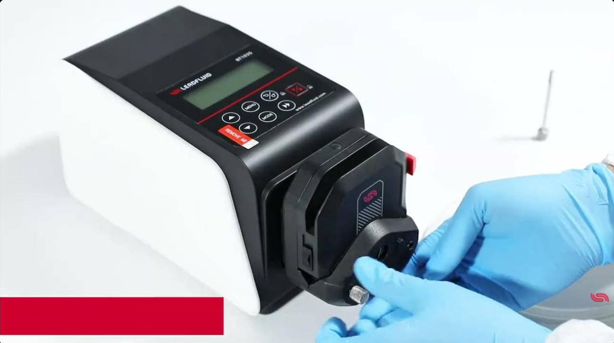
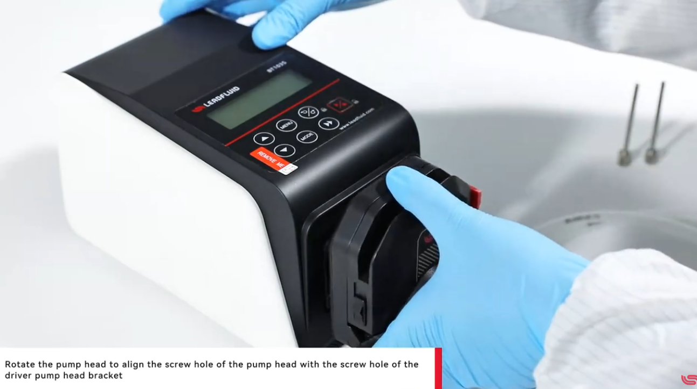
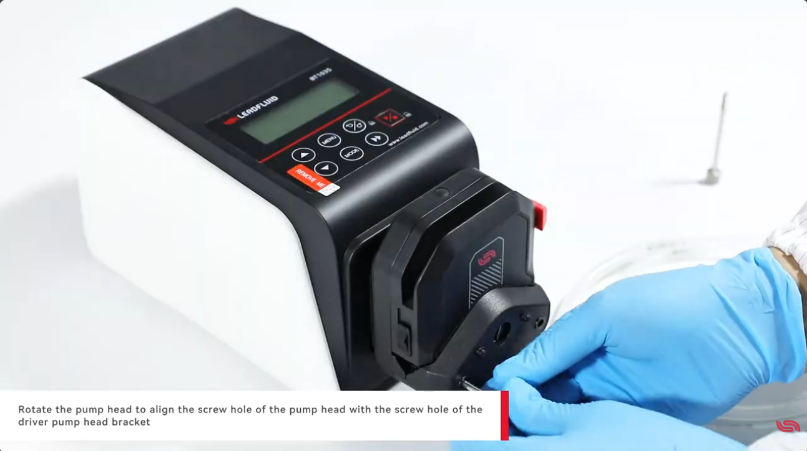
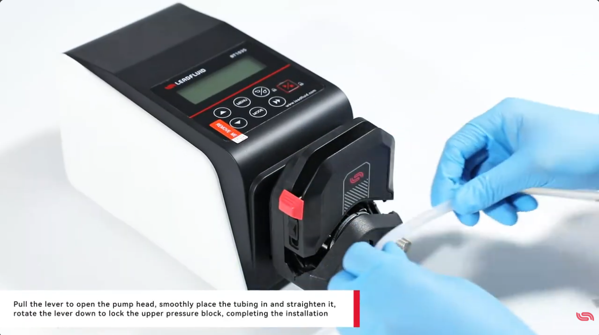

# 처음이라도 괜찮아요 — BT103S 펌프헤드 장착부터 튜브 끼우기까지

연동펌프를 처음 받으면 가장 먼저 마주하는 일이 본체에 펌프헤드를 달고 튜브를 끼우는 일이에요. 복잡해 보이지만 실제로는 몇 동작이면 끝납니다. 이 글에서는 Lead Fluid BT103S 가변속 연동펌프를 예로, 헤드를 장착하고 튜브를 넣는(또는 교체하는) 과정을 차근차근 따라가 볼게요. 준비물은 고정나사를 조일 드라이버 하나면 충분합니다.

## 시작하기 전에, 공간부터 살펴봐요

먼저 한 가지만 확인하고 가면 좋아요. 본체 뒷면에는 최소 200mm 정도의 여유 공간을 두는 것이 좋습니다. 방열과 케이블 연결을 위한 공간이라, 장비를 벽에 너무 붙여 두면 나중에 번거로워질 수 있거든요. 영상에서는 15T 펌프헤드와 25번 튜브를 예로 사용하니, 같은 규격이 있으면 함께 준비해 주세요.

## 1단계. 펌프헤드를 본체에 장착하기 (0:54–1:17)

헤드 장착은 크게 세 동작이에요. 축을 끼우고, 나사 구멍을 맞추고, 나사를 조이는 순서로 생각하면 쉽습니다.

먼저 펌프헤드 뒤쪽의 평평한 축을 본체 커플링의 홈 방향에 맞춰 부드럽게 밀어 넣어 주세요. 축 단면이 한쪽이 평평한 D자 모양이라, 방향이 맞아야 끝까지 들어갑니다. 억지로 밀지 말고 방향만 살짝 돌려가며 맞춰 보면 자연스럽게 들어가요.

*0:59 — 헤드의 평평한 축을 본체 커플링 홈에 맞춰 밀어 넣는 모습이에요.*

축이 들어갔으면, 이번엔 헤드 몸체를 천천히 돌려서 헤드 쪽 나사 구멍과 본체 브래킷의 나사 구멍이 서로 만나도록 위치를 맞춰 줍니다.

*1:09 — 헤드를 좌우로 살살 돌려 나사 구멍 위치를 맞추는 단계입니다.*

구멍이 맞았다면 고정나사 2개를 끼우고 조여 주세요. 이 두 개만 잘 조이면 헤드 장착은 마무리됩니다.

*1:13 — 정렬된 구멍에 고정나사를 넣고 조여 헤드를 단단히 고정합니다.*

## 2단계. 튜브 넣기 — 교체할 때도 똑같아요 (1:18–1:29)

헤드 위쪽의 레버를 손으로 당겨 올리면 헤드가 열립니다. 이때 튜브를 롤러 위 홈에 평평하게, 꼬이거나 비틀리지 않도록 곧게 눕혀 넣어 주세요. 튜브가 삐뚤게 들어가면 유량이 흔들릴 수 있으니 반듯하게 자리 잡았는지만 한 번 봐 주면 좋아요.

*1:22 — 레버를 연 상태에서 튜브를 홈에 평평하게 넣는 모습입니다.*

튜브가 자리를 잡았으면 레버를 다시 아래로 내려 상단 압착블록을 잠가 주세요. 여기까지 하면 설치가 끝납니다. 나중에 튜브를 교체할 때도 순서는 똑같아요. 레버를 열고, 쓰던 튜브를 빼고, 새 튜브를 넣어 곧게 정렬한 뒤, 레버를 내려 잠그면 됩니다. 따로 공구가 필요 없이 레버 조작만으로 끝나서 생각보다 훨씬 간단해요.

## 마무리하며

- 작업은 본체 뒤 200mm 공간을 확보하는 것부터 시작해요.
- 헤드 장착은 축 끼우기 → 나사 구멍 맞추기 → 고정나사 2개 조이기, 이 세 동작이면 됩니다.
- 튜브는 레버 열고 → 평평하게 넣고 → 레버 잠그기. 교체도 같은 순서예요.
- 필요한 공구는 드라이버 하나뿐이고, 몇 번 해보면 1~2분이면 충분합니다.

참고로 전원을 켜면 기본 운전값이 미리 설정돼 있어서 시작 버튼만 눌러도 바로 돌아가요. 운전이나 메뉴 조작은 이 글의 범위를 넘어서니, 궁금하시면 원본 영상 1:30 이후 부분을 참고해 주세요.

---

**출처:** Lead Fluid Pump — How to install and use the BT103S variable speed peristaltic pump for the first time?
https://www.youtube.com/watch?v=dr5qszk90yU
