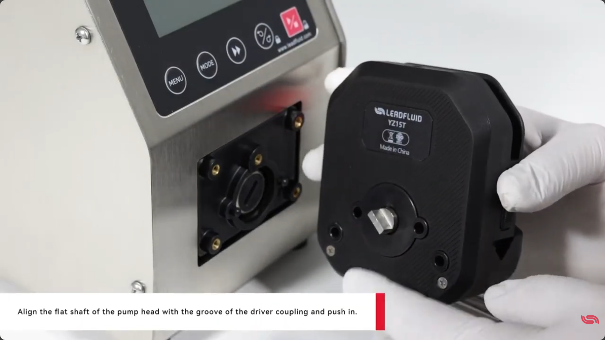
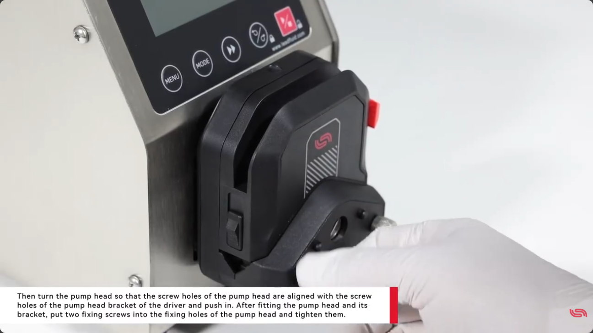
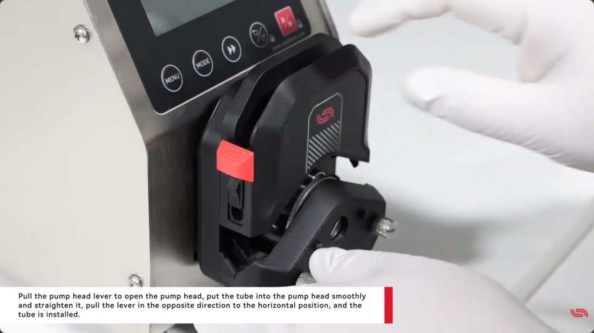

# BT600S 처음 쓸 때 — 펌프헤드 장착부터 튜브 끼우기까지

BT600S 연동펌프를 처음 받으면 본체(드라이버)에 펌프헤드를 달고 튜브를 끼우는 것부터 시작해요. 이 글은 Lead Fluid BT600S를 기준으로, 개봉 확인부터 YZ15T 헤드 장착과 튜브 설치까지 차근차근 따라가 봅니다. 준비물은 고정나사를 조일 드라이버 하나면 충분해요.

## 개봉하고 구성품부터 확인해요

먼저 패킹 리스트를 보면서 빠진 것이나 손상된 게 없는지 확인해 주세요. 기본 구성은 드라이버(본체), YZ15T 펌프헤드, 제품 카탈로그, 매뉴얼, 전원 코드, 그리고 부속품이에요.

설치 위치도 한 가지만 신경 쓰면 됩니다. 본체 뒷면에는 최소 200mm의 여유 공간을 두세요. 방열과 케이블 연결을 위한 공간이라, 벽에 너무 붙여 두면 나중에 번거로워질 수 있어요.

## 1단계. YZ15T 펌프헤드 장착하기

헤드 장착은 축을 끼우고, 나사 구멍을 맞추고, 나사를 조이는 세 동작이에요.

먼저 펌프헤드의 평평한 축을 드라이버 커플링의 홈 방향에 맞춰 밀어 넣어 주세요. 축 단면이 한쪽이 평평한 모양이라 방향이 맞아야 끝까지 들어갑니다.

*0:59 — YZ15T 헤드의 평평한 축을 드라이버 커플링 홈에 맞춰 밀어 넣는 모습이에요.*

축이 들어갔으면 헤드를 돌려서 헤드 쪽 나사 구멍과 드라이버 헤드 브래킷의 나사 구멍을 맞춰 줍니다. 위치가 맞으면 고정나사 2개를 고정홀에 넣고 조여 주세요.

*1:14 — 나사 구멍을 맞춘 뒤 고정나사 2개로 헤드를 단단히 고정합니다.*

## 2단계. 튜브 끼우기

헤드 위쪽의 레버를 당겨 헤드를 열어 주세요. 튜브를 헤드 안에 부드럽게 넣고 꼬임 없이 곧게 펴 줍니다. 그다음 레버를 반대 방향(수평 위치)으로 돌려 닫으면 튜브 장착이 끝납니다.

*1:22 — 레버를 열어 튜브를 넣고, 레버를 수평으로 돌려 닫으면 설치 완료.*

## 마무리하며

- 개봉 후 구성품(드라이버·YZ15T 헤드·전원 코드·부속품)부터 확인하고, 본체 뒤 200mm 공간을 확보하세요.
- 헤드 장착은 축 결합 → 나사 구멍 정렬 → 고정나사 2개 체결.
- 튜브는 레버 열고 → 곧게 넣고 → 레버 닫기.

여기까지 하면 하드웨어 준비는 끝이에요. 전원을 켜고 실제로 펌프를 조작하는 방법은 다음 편(내부 제어 모드 조작)에서 이어집니다.

---

**출처:** Lead Fluid Pump — How to set up and use the BT600S speed variable intelligent peristaltic pump for the first time?
https://www.youtube.com/watch?v=MY1am65YBnA
