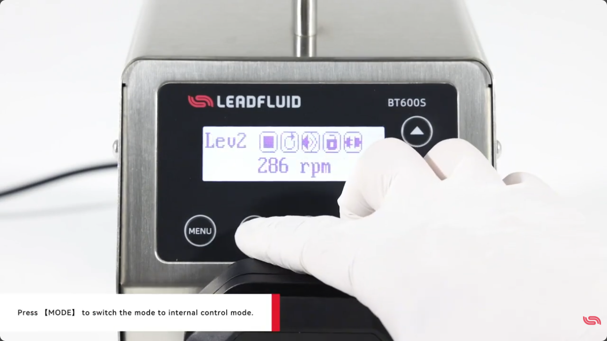
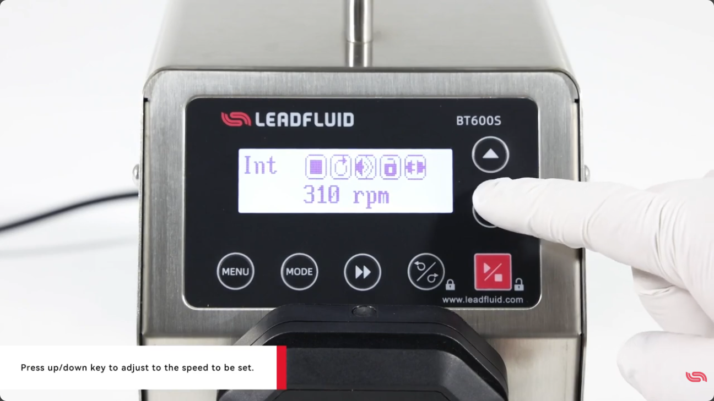
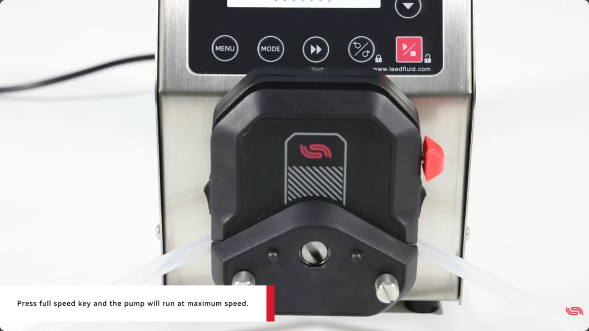

# BT600S 내부 제어 모드로 펌프 조작하기

헤드와 튜브까지 장착했다면 이제 실제로 펌프를 돌릴 차례예요. BT600S의 가장 기본이 되는 조작이 바로 **내부 제어 모드(internal control mode)** 입니다. 앞면 패널의 키만으로 펌프를 직접 제어하는 방식이라, PC나 외부 신호 없이도 바로 쓸 수 있어요. Lead Fluid BT600S를 기준으로 순서대로 따라가 볼게요.

## 전원을 켜고 시작해요

뒷면 전원 스위치를 켜면 LCD 화면에 환영 메시지가 잠깐 뜬 뒤 메인 화면으로 들어갑니다. 여기서부터 앞면 키로 조작하면 돼요.

## 내부 제어 모드로 전환하기

**MODE 키**를 누르면 제어 모드가 전환됩니다. 내부 제어 모드로 맞춰 주세요. 이 모드에서는 앞면 패널의 키가 곧 펌프의 조작 수단이 됩니다.

*0:26 — MODE 키를 눌러 내부 제어 모드로 전환합니다.*

## 속도와 방향 설정하기

**up / down 키**로 원하는 속도(rpm)를 맞춥니다. 화면 아래쪽에 현재 속도가 rpm으로 표시돼요.

*0:31 — up/down 키로 설정할 속도를 맞춥니다. 화면에 'Int'(내부 제어) 표시와 rpm이 함께 나와요.*

회전 방향은 **direction(정역) 키**로 바꿀 수 있습니다. 그리고 **start/stop 키**를 누르면 펌프가 시작되거나 멈춰요.

## 최대 속도로 바로 돌리기

**full speed 키**를 누르면 펌프가 최대 속도로 돌아갑니다. 세척이나 빠른 배출처럼 잠깐 최고 속도가 필요할 때 편리해요.

*0:53 — full speed 키를 누르면 펌프가 최대 속도로 운전됩니다.*

## 마무리하며

- 전원 ON → LCD 메인 화면 진입
- MODE 키로 내부 제어 모드 전환
- up/down 키로 속도, direction 키로 방향, start/stop 키로 운전·정지
- full speed 키로 최대 속도 즉시 운전

키 몇 개만 익히면 대부분의 기본 조작이 끝나요. 속도를 더 세밀하게 잡거나 원클릭으로 최고·최저 속도로 바꾸는 방법은 다음 편(속도 설정)에서 다룹니다.

---

**출처:** Lead Fluid Pump — How to operate the internal control mode of BT600S?
https://www.youtube.com/watch?v=Z-gZqj6xkk0
