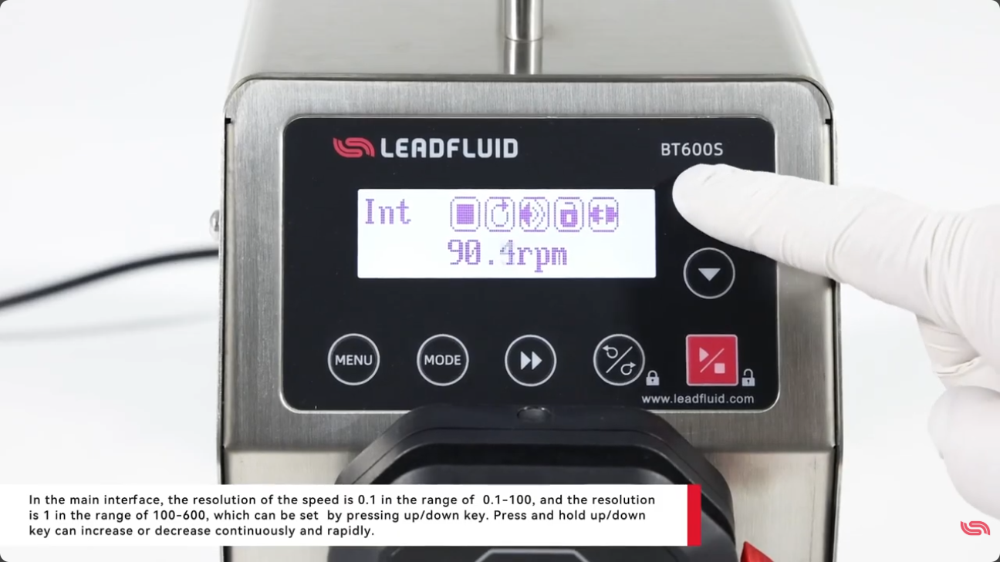
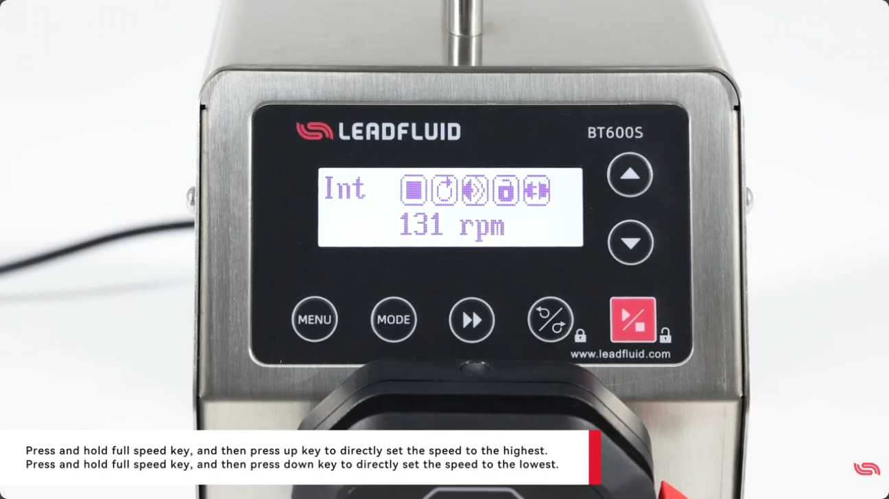
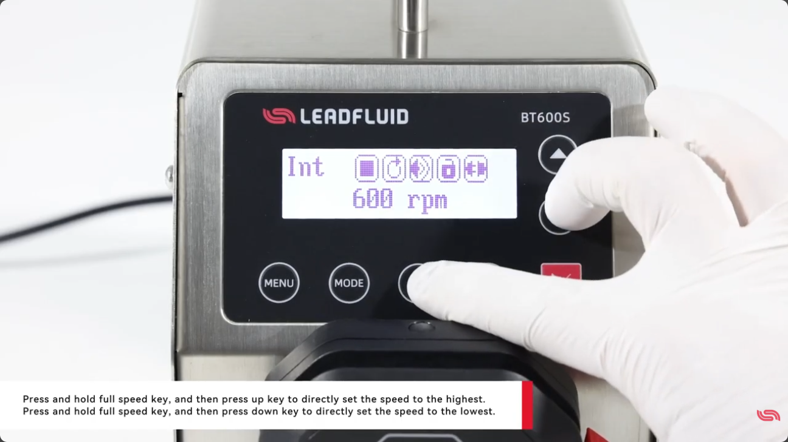

# BT600S 속도 세밀하게 맞추기 — 원클릭으로 최고·최저 속도까지

BT600S는 속도를 아주 세밀하게 조절할 수 있고, 버튼 조합 하나로 최고 속도나 최저 속도로 바로 점프할 수도 있어요. 매번 up/down을 오래 누르지 않아도 되는 편리한 기능이라, 알아 두면 조작이 훨씬 빨라집니다. Lead Fluid BT600S를 기준으로 정리했어요.

## 속도 분해능 — 구간에 따라 달라져요

메인 화면에서 up/down 키로 속도를 조절할 때, **속도 구간에 따라 조절 단위(분해능)가 달라집니다.**

- 0.1 ~ 100 rpm 구간: **0.1 단위**로 세밀하게 조절
- 100 ~ 600 rpm 구간: **1 단위**로 조절

저속에서는 0.1 rpm 단위로 촘촘하게 맞출 수 있어서 정밀한 유량 세팅에 유리해요.

*0:24 — 저속 구간에서는 0.1 단위(예: 90.4rpm)로 세밀하게 속도가 조절됩니다.*

## 빠르게 올리고 내리기

up 또는 down 키를 **길게 누르고 있으면** 속도가 연속으로 빠르게 오르거나 내려갑니다. 큰 폭으로 속도를 바꿀 때 하나씩 누르지 않아도 돼요.

## 원클릭으로 최고·최저 속도로

여기가 핵심이에요. 버튼 조합으로 한 번에 양 끝 속도로 갈 수 있습니다.

- **full speed 키를 누른 상태에서 up 키** → 속도가 곧바로 **최고**로 설정
- **full speed 키를 누른 상태에서 down 키** → 속도가 곧바로 **최저**로 설정

*0:45 — full speed 키를 누른 채 up은 최고, down은 최저 속도로 바로 설정됩니다.*

예를 들어 full speed + up을 쓰면 화면 속도가 곧장 최고값(600 rpm)으로 올라갑니다.

*0:53 — full speed + up으로 최고 속도 600 rpm이 한 번에 설정된 모습.*

## 마무리하며

- 속도 분해능: 0.1~100 rpm은 0.1 단위, 100~600 rpm은 1 단위
- up/down 길게 누르기 → 연속으로 빠르게 증감
- full speed + up → 최고 속도로 원클릭
- full speed + down → 최저 속도로 원클릭

세밀 조절과 원클릭 점프를 같이 쓰면, 실험 중 속도를 바꿀 때 시간을 많이 아낄 수 있어요.

---

**출처:** Lead Fluid Pump — Does BT600S support one click quick adjustment to the highest or lowest speed?
https://www.youtube.com/watch?v=QMkYbTkQgVU
